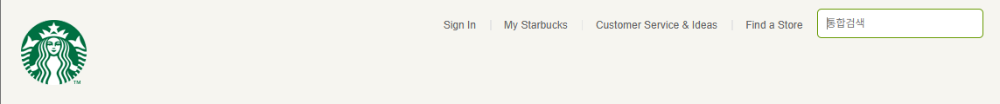

# starbucks-clone

HTML/CSS 기초 학습 및 웹 페이지 클론 코딩 프로젝트입니다.  
스타벅스의 공식 웹페이지를 참고하여, 단계적으로 구현합니다.

## Day 1

<details>
<summary>Head 태그 설정 요약</summary>

### 문자 인코딩 설정

```html
<meta charset="UTF-8" />
```

- 한글 및 특수문자 인식 가능
- UTF-8: 초성·중성·종성으로 분리 저장하는 표준 인코딩 방식

---

### 뷰포트 설정

```html
<meta name="viewport" content="width=device-width, initial-scale=1.0" />
```

- width=device-width: 디바이스 가로 폭에 맞춤
- initial-scale: 초기 배율 설정
- 기타 옵션:
  - user-scalable=no
  - maximum-scale
  - minimum-scale

---

### 오픈 그래프 (Open Graph)

```html
<meta property="og:type" content="website" />
<meta property="og:site_name" content="Starbucks" />
<meta property="og:title" content="Starbucks Coffee Korea" />
<meta property="og:description" content="스타벅스는 세계에서 가장 큰 다국적 커피 전문점으로, 64개국에서 총 23,187개의 매점을 운영하고 있습니다." />
<meta property="og:image" content="./images/starbucks_seo.jpg" />
<meta property="og:url" content="https://starbucks.co.kr" />
```

- SNS 공유 시 메타 정보로 사용됨

---

### 트위터 카드

```html
<meta property="twitter:card" content="summary" />
<meta property="twitter:site" content="Starbucks" />
<meta property="twitter:title" content="Starbucks Coffee Korea" />
<meta property="twitter:description" content="스타벅스는 세계에서 가장 큰 다국적 커피 전문점으로, 64개국에서 총 23,187개의 매점을 운영하고 있습니다." />
<meta property="twitter:image" content="./images/starbucks_seo.jpg" />
<meta property="twitter:url" content="https://starbucks.co.kr" />
```

- 트위터 공유 시 메타 정보로 사용됨

---

### 파비콘

```html
<link rel="icon" href="./favicon.png" />
```

- 브라우저 탭에 표시되는 아이콘
- `.ico`는 기본 적용, `.png`는 직접 지정 필요
- 추천 크기: 16x16, 32x32, 500x500

---

### Google Fonts & Material Icons

```html
<!-- 나눔고딕 폰트 적용 -->
<link href="https://fonts.googleapis.com/css2?family=Nanum+Gothic&display=swap" rel="stylesheet" />

<!-- 머터리얼 아이콘 사용 -->
<link rel="stylesheet" href="https://fonts.googleapis.com/icon?family=Material+Icons" />
```

- 구글에서 제공하는 무료 리소스
- 폰트 사용 시 라이선스 확인 필요

</details>

## Day 2

<details>
<summary>Header 구조 및 정렬 방식</summary>

### 이미지 기본 속성 및 정렬

- 이미지 기본 height: `75px`
- 인라인 요소의 기본 베이스라인 공백 제거 → `display: block` 사용

---

### 정렬 방식 1 - 가운데 정렬 (가장 일반적인 패턴)

```css
header {
  background-color: royalblue;
}
header .inner {
  width: 1100px;
  height: 120px;
  margin: 0 auto;
}
```

- `.inner`에 고정 너비 부여
- `margin: 0 auto`로 수평 중앙 정렬

---

### 정렬 방식 2 - 수직 중앙 정렬 (로고 등 위치 조정)

```css
.logo {
  height: 75px;
  position: absolute;
  top: 0;
  bottom: 0;
  margin: auto 0;
}
```

- 상하 위치 기준을 0으로 지정
- 요소에 `height` 필수
- 부모 요소는 `position: relative` 필요


- a태그에서 링크가 준비되어있지 않을때,
javascript:void(0)과 # 해쉬코드를 작성하는 2가지 방법이 있음

javascript 연동시 defer 속성 확인할 것! 

아래는 Day 2까지 작업한 결과입니다.

```

```


</details>


## Day 3

<details>
<summary>드롭다운 메뉴, 스크롤 이벤트, BEM 네이밍 정리</summary>

### 드롭다운 메뉴 구현

- `<header>` 안의 `.badges` 요소를 기준으로 **스크롤 이벤트 발생 시 배지 숨김/보임 처리**
- 외부 라이브러리:
  - `lodash`: `_.throttle()` 함수로 스크롤 이벤트 제한
  - `GSAP`: 애니메이션 처리 (투명도 및 display)

```html
<script src="https://cdnjs.cloudflare.com/ajax/libs/lodash.js/4.17.21/lodash.min.js"></script>
<script src="https://cdnjs.cloudflare.com/ajax/libs/gsap/3.12.2/gsap.min.js"></script>
```

```javascript
const badgeEl = document.querySelector('header .badges');

window.addEventListener('scroll', _.throttle(function () {
  if (window.scrollY > 500) {
    gsap.to(badgeEl, .6, {
      opacity: 0,
      display: 'none'
    });
  } else {
    gsap.to(badgeEl, .6, {
      opacity: 1,
      display: 'block'
    });
  }
}, 300));
```

- `_.throttle(함수, 시간)`  
  → 지정된 시간 간격으로 함수 실행 제한 (성능 최적화)
- `gsap.to()`  
  → 요소에 대해 애니메이션 처리

---

### inner 클래스의 역할

```css
.inner {
  width: 1100px;
  margin: 0 auto;
}
```

- 고정된 넓이로 **한 줄의 콘텐츠를 가운데로 정렬**해주는 컨테이너 역할

---

### BEM 네이밍 방식

- **BEM**: Block Element Modifier  
  HTML 클래스 이름의 체계적인 작성법

```html
<!-- 예시 -->
<div class="menu">
  <div class="menu__item"></div>
  <div class="menu__item menu__item--active"></div>
</div>
```

- `block__element`: 블록 내의 구성 요소
- `block--modifier`: 블록의 상태나 변형 (예: `is-active`, `--disabled`)

---

### position: absolute / fixed 의 너비 줄어듦 현상

- `absolute`, `fixed` 요소는 **기본적으로 내용만큼의 너비만 가짐**
- `width`를 명시하지 않으면 inline-block처럼 줄어들 수 있음
- 해결법:
  ```css
  position: absolute;
  width: 100%;
  ```
  
아래는 Day 3까지 작업한 결과입니다.

```

```


</details>

## Day 4

<details>
<summary>Body 섹션 진입 및 순차적 이미지 페이드인</summary>

### Body 섹션 구성 시작

- 지금까지는 `<header>` 영역을 작업했고, 이번부터는 본격적으로 `<body>` 섹션 작업 시작
- 구조보다 **시각적 효과와 레이아웃 연출** 중심으로 작업 진행

---

### 스타일 클래스 설계 및 재사용 방식

- 버튼 디자인을 CSS에서 미리 만들어두고, HTML에 클래스로 호출하여 재사용
- 상태/크기 등을 클래스 조합으로 처리

```html
<button class="btn btn--primary">버튼1</button>
<button class="btn btn--secondary btn--large">버튼2</button>
```

- `btn`: 공통 버튼 디자인  
- `btn--primary`, `btn--secondary`: 버튼 상태 구분  
- `btn--large`: 버튼 크기 구분

---

### GSAP을 이용한 순차적 이미지 페이드인 효과

- `.visual .fade-in` 요소들에 대해 순서대로 나타나는 애니메이션 적용
- 외부 라이브러리 **GSAP** 사용

```javascript
const fadeEls = document.querySelectorAll('.visual .fade-in');

fadeEls.forEach(function (fadeEl, index) {
  gsap.to(fadeEl, 1, {
    delay: (index + 1) * 0.7, // 요소마다 0.7초씩 딜레이
    opacity: 1                // 점점 나타나게 함
  });
});
```

- `querySelectorAll()`로 대상 요소 선택  
- `forEach()`로 반복 처리  
- `gsap.to()`로 애니메이션 적용  
- `delay`: 등장 시점을 순차적으로 설정


</details>

